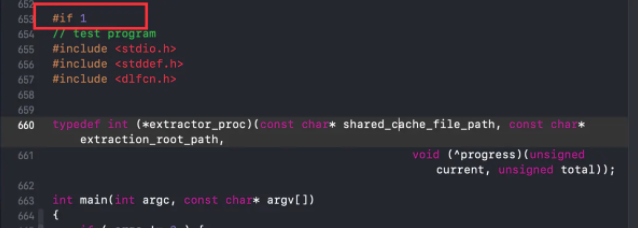
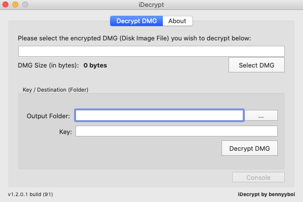

## 从iOS固件ipsw中提取系统符号表

提取系统的符号表一般从iOS真机中获取，但是有一些情况难以获取到对应系统的真机。

例如：iOS10.3.4的发布时间是2019年7月23日，iOS10.3.3的发布时间是2017年7月19日，中间间隔了两年的时间。在2020年，如果要获取iOS10.3.3的真机实在是太难了，因为官方只支持升级到最新系统。

> iOS系统历史版本以及发布时间可参考[wiki](https://zh.wikipedia.org/wiki/IOS版本历史)

这个时候就要用其他的方法获取到系统符号表。例如从ipsw固件中获取。

#### 准备

1. 去一些固件下载网站[theiphonewiki.com](https://www.theiphonewiki.com/wiki/Firmware)下载对应版本的固件。
2. 下载dmg解密工具，VFDecrypt命令行或者是它的客户端iDecrypt等能够解密dmg的工具。此处提供一个[iDecrypt](https://supergithuber.github.io/Resources/iDecrypt-Mac-build91-bennyyboi.zip)。
3. 下载dyld源码，使用其中的dsc_extractor工具，下载地址[dyld源码](https://opensource.apple.com/tarballs/dyld/)，我使用了dyld-519.2.2.tar.gz。
4. 下载完dyld源码后，解压，打开进入launch-cache打开dsc_extractor.cpp文件，将预处理指令从0改为1

5. 进入到launch-cache目录，通过clang命令编译dsc_extractor.cpp

```shell
clang++ -o dsc_extractor ./dsc_extractor.cpp dsc_iterator.cpp
```


#### 获取过程

1. 将下载来的ipsw改为zip，解压。找到解压目录下最大的哪个dmg文件，就是待解密的dmg文件。

2. 通过iDecrypt解密dmg，这里的key要从下载固件的网站获取，theiphonewiki中的**SHA1 Hash**


3. 解压后可以双击打开dmg文件，在其中的`System/Library/Caches/com.apple.dyld`目录下可以看到`dyld_shared_cache_arm64、dyld_shared_cache_armv7s、dyld_shared_cache_armv7`类似这样的文件，这些就是压缩的系统库。

4. 需要通过之前准备的dsc_extractor来解压获取，使用方法

   ```shell
   ./dsc_extractor 'dyld_shared_cache_armXX文件路径' '输出路径'
   ```

5. 在Xcode11以前，如果把不同的架构的压缩文件，提取到相同的输出路径，会自动合并。xcode11之后不会合并，如果需要合并，自己通过lipo命令合并一下。

6. 参考系统符号表的目录结构，系统符号表在`~/Library/Developer/Xcode/iOS DeviceSupport`下，把输出路径的东西，放到一个类似`12.4.6 (16G183)/Symbols`这样的目录下，就完成了系统符号表的提取。🤩
