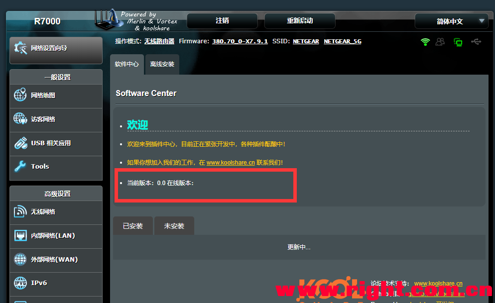

## 梅林固件无法访问软件中心

梅林界面的软件中心一直显示当前版本为0，并且无法查看到插件



这是由于之前的固件，插件中心是通过访问[https://ngrok.wang](https://ngrok.wang/)，现在这个域名已经没有续费了，需要修改固件内的域名。

通过ssh连接路由器，然后通过下面的脚本修改url

```shell
sed -i 's/koolshare.ngrok.wang/ks.ddnsto.com/g' /koolshare/scripts/ks_app_install.sh
sed -i 's/koolshare.ngrok.wang/ks.ddnsto.com/g' /koolshare/webs/Main_Soft_center.asp
```


