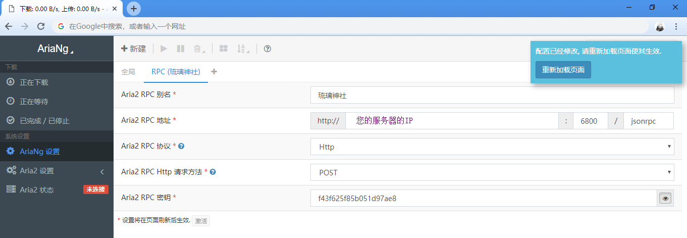

## 在centos下搭建离线下载播放器【aria2+h5ai】

经常拿到一些种子或者是磁力链接，下载半天才能看，觉得很麻烦，就利用服务器搭建了一个aria2下载器，给任务给它，然后下载完成后直接在线观看。

#### 准备条件：

1. centos7 服务器，建议使用centos7的，centos6以前的2020以后就不维护了。
2. 宝塔面板，宝塔Linux面板是提升运维效率的服务器管理软件，支持一键LAMP/LNMP/集群/监控/网站/FTP/数据库/JAVA等100多项服务器管理功能。[宝塔官网](https://www.bt.cn/) , [宝塔安装教程](https://www.bt.cn/bbs/thread-19376-1-1.html)
3. 已搭建好lnmp环境，PHP版本为7.2（h5ai需要lnmp）。

-----

#### 步骤

##### 1. 安装Aria2

可以去网上用命令行一步一步安装，也有moerats一键安装脚本

> wget -N --no-check-certificate https://www.moerats.com/usr/shell/Aria2/aria2.sh && chmod +x aria2.sh && bash aria2.sh 
>
> //备用
>
> wget -N --no-check-certificate https://raw.githubusercontent.com/ToyoDAdoubiBackup/doubi/master/aria2.sh && chmod +x aria2.sh && bash aria2.sh


按照提示来就行，最后安装完成会出现配置信息，如果没出现或者忘了就去~/.aria2/aria2.conf  这个目录下找，主要是那个PRC秘钥`rpc-secret`，配置连接的时候要用到。

附上一些简单的使用命令：

```shell
## 启动
aria2c --conf-path=~/.aria2/aria2.conf
## 无错误启动
aria2c --conf-path=~/.aria2/aria2.conf -D
## 防火墙开启端口
firewall-cmd --zone=public --add-port=6800/tcp --permanent
systemctl restart firewalld.service
```

##### 2. 用AriaNG管理Aria2

AriaNG是一个Aria2的前端管理工具，github[地址](https://github.com/mayswind/AriaNg/releases)

直接下载release下的AriaNG All In One，在本地打开html运行，配置RPC密码、服务器地址、aria2端口号



##### 3.使用_h5ai实现在线播放