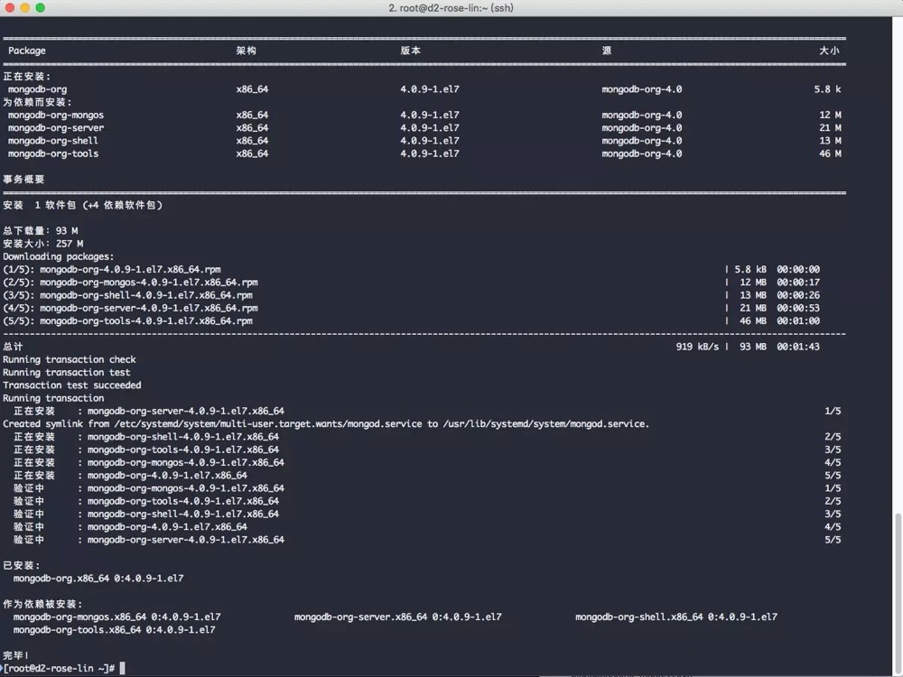
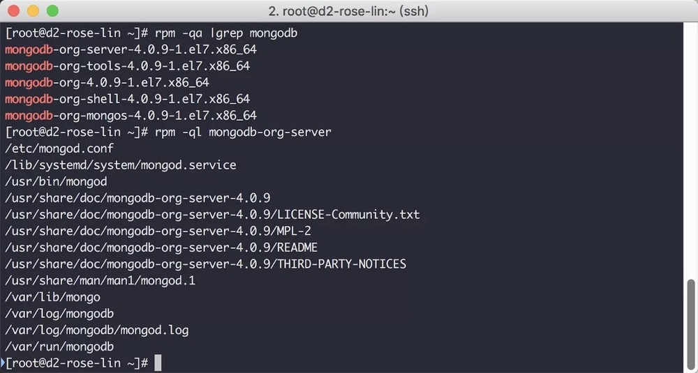

## 在centOS下安装MongoDB

- 首先官方的安装指引在[这里](https://docs.mongodb.com/manual/tutorial/install-mongodb-on-red-hat/)，如果官方更新，可能会有些许变动

1. 创建.repo文件，生成mongodb的源

```shell
vim /etc/yum.repos.d/mongodb-org-4.2.repo
```

2. 添加一下配置信息

```shell
[mongodb-org-4.2]
name=MongoDB Repository
baseurl=https://repo.mongodb.org/yum/redhat/$releasever/mongodb-org/4.2/x86_64/
gpgcheck=1
enabled=1
gpgkey=https://www.mongodb.org/static/pgp/server-4.2.asc
```

info:

```shell
name         # 名称
baseurl      # 获得下载的路径
gpkcheck=1   # 表示对从这个源下载的rpm包进行校验；
enable=1     # 表示启用这个源。
gpgkey       # gpg验证
```

3. 保存退出

-------

1. 安装MongoDB

```shell
sudo yum install -y mongodb-org
```



如果安装的时候有提示Error: mongodb-org-mongos conflicts with mongodb类似这种版本冲突错误，就把原来的版本卸载了

```shell
yum remove mongodb*
yum clean all
```


2. 验证安装结果

```shell
rpm -qa |grep mongodb
```

```shell
rpm -ql mongodb-org-server
```



3. 启动服务

```shell
systemctl start mongod.service
```

看默认端口是够开启

```shell
netstat -natp | grep 27017
```

看下数据库进程是否启动

```shell
ps -aux | grep mongod
```

------

远程访问数据库

1. 修改配置文件mongodb.conf

```shell
vi /etc/mongod.conf

# network interfaces
net:
  port: 27017
  bindIp: 0.0.0.0  # Enter 0.0.0.0,:: to bind to all IPv4 and IPv6 addresses or, alternatively, use the net.bindIpAll setting.
```

修改绑定ip默认127.0.0.1只允许本地连接， 所以修改为bindIp:0.0.0.0

2. 重启服务

```shell
sudo service mongod restart 
```

3. 开启防火墙给这个端口

```shell
systemctl status firewalld  # 查看防火墙状态
firewall-cmd --zone=public --add-port=27017/tcp --permanent # mongodb默认端口号
firewall-cmd --reload  # 重新加载防火墙

firewall-cmd --zone=public --query-port=27017/tcp # 查看端口号是否开放成功，输出yes开放成功，no则失败
```

如果你是阿里云这种有安全组规则配置的，记得去控制台打开对应的端口。

